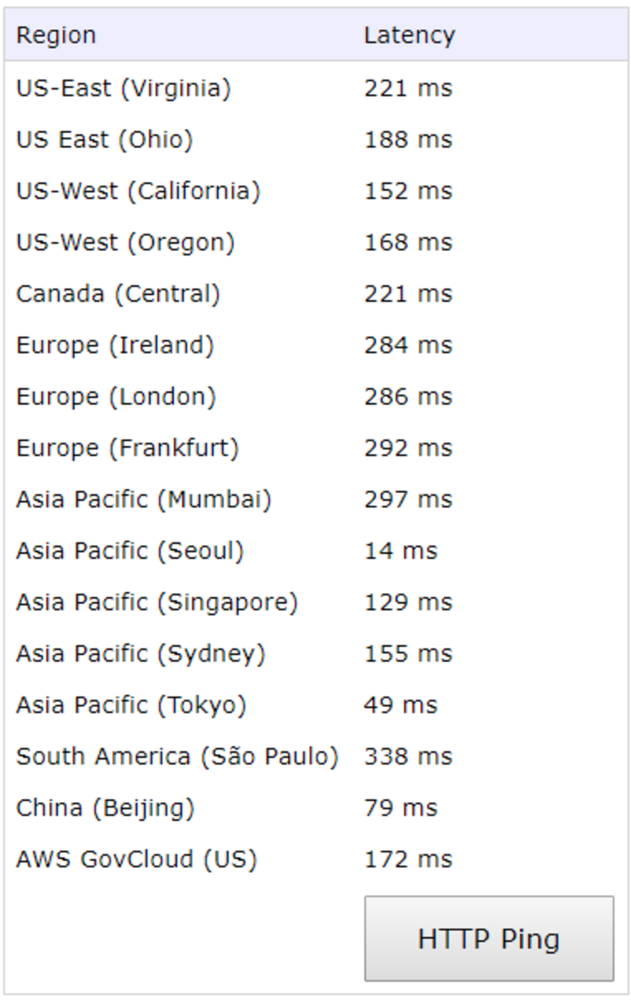
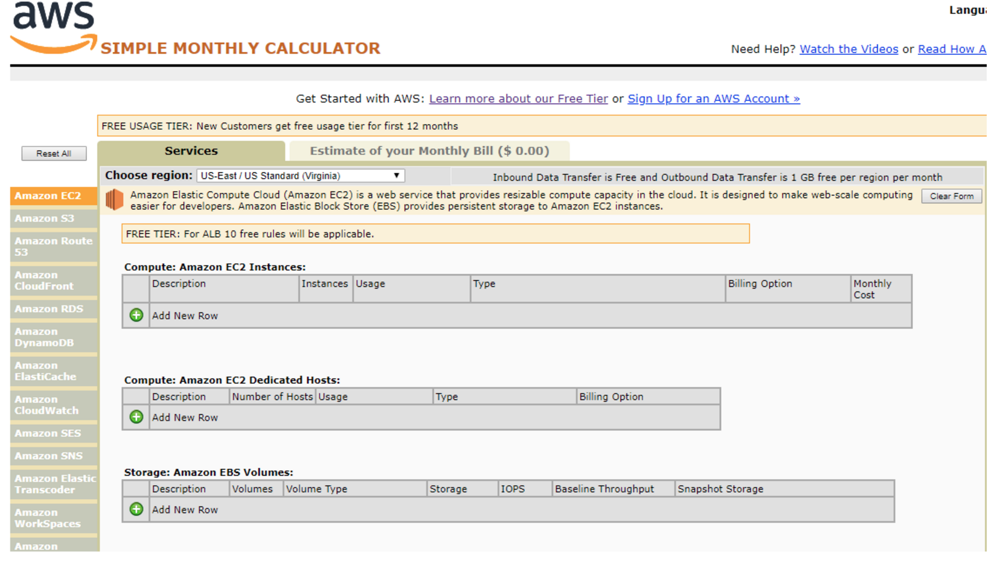

# 알아두면 쓸모있는 AWS 기능

AWS와 관련된 알아두면 쓸모있는 지식들

* **AWS Region** **속도** **비교** http://www.cloudping.info

* AWS 요금 계산기 \( http://calculator.s3.amazonaws.com/index.html \)

* 공인 IP확인하기 http://checkip.amazonaws.com  

**AWS와 관련없지만 알아두면 쓸모있는 지식들**

* **$ yes &gt; /dev/null** yes 명령어 : y가 무수히 출력된다. y를 /dev/null로 계속해서 전송한다. 이때, /dev/null은 블랙홀 같은 파일이다. 무언가 저장하면 그냥 없어지는 파일이다. 무한루프를 끝내고 싶다면, 'Ctrl + C'로 나오자
* * **UTC값** **생성하기** https://www.epochconverter.com  

