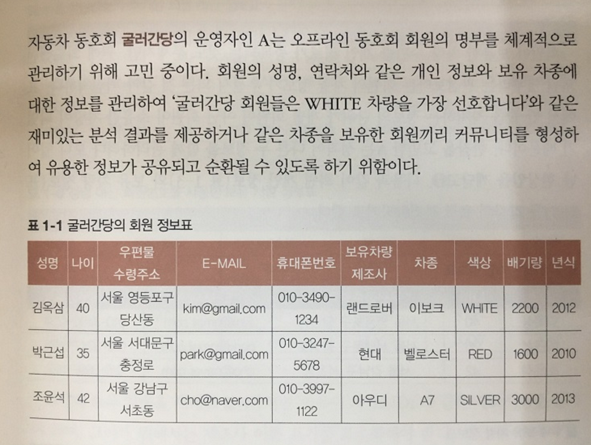

# 20180205

**용어 정리**

1.엔티티 \(entity\) : 사물의 구조나 상태, 동작 등을 모델로 표현하는 경우 그 모델의 구성 요소.

2.관계형 데이터베이스 \(relational data base\) : 데이터를 계층 구조가 아닌 단순한 표로 표현하는 형식의 데이터 베이스

3.정규화 \(normalization\) : 데이터의 보존성을 높이는 등의 목적에서 데이터베이스 내에서 같은 정보가 2번 이상 기록되지 않고, 테이블 하나하나는 주 키에서 직접 연상되는 데이터만으로 구성되도록 설계하는 것이 이상적이다.

4.기본 키 = 고유키 = PK = primary key 외래 키 = 참조키 = FK = foreign ke

**오늘의** **문제**

해결

1. 표는 관계형 데이터베이스의 릴레이션을 의미한다.
2. 이질적인 정보가 혼재되어 있다면 데이터 간의 종속성을 기준으로 분리, 즉 정규화해야 함을 의미
3. ‘보유 차량 정보 표’를 분리한 것은 1정규화가 적용된 결과다. 예를 들어, 김옥삼씨의 보유 차량이 2대일 경우, 어떻게 처리하면 좋을지에 대한 해결책이다.
4. 표 사이의 연결고리는 데이터 모델의 관계 속성에 해당한다.
5. 회원번호는 엔터티의 주 식별자에 해당한다. 예를 들어, ‘김옥삼’이라는 이름을 가진 사람이 2명일 경우 해결 방법이다.
6. ‘AUDI’를 ‘아우디’로 표기하기로 한 것은 데이터 표준화의 개념 중 코드와 관련 있다.
7. 협력업체 정보표를 별도로 만든 것은 엔터티의 개념이 반영된 것이다.

