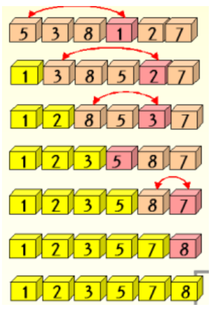

# 선택정렬

**현재 위치에 들어갈 값을 찾는 정렬방식이다.**

시간복잡도 : O\(n^2\) : 버블 정렬과 마찬가지로 비효율적

쉽게보면 오름차순 기준으로 보면 정렬이 안된 숫자들 중에서 최소값을 선택하여 배열의 앞으로 대려오는 것이다.



**-동작방식**

**1. 현재 인덱스 이상의 배열값 중 가장 작은 값을 찾는다. \(시작시 현재 인덱스는 0\)  
2. 찾은 값을 현재 인덱스의 값과 바꾸고 현재 인덱스를 하나더 늘린다.  
3. 현재 인덱스가 마지막 인덱스가 될때 까지 반복한다.**

```text
#Python
def selection_sort(alist) :
    for i in range(len(alist)-1):
        min = i 
        for j in range(i + 1, len(alist)) :
            if alist[j] < alist[min] :
                min = j
                temp = alist[i]
                alist[i] = alist[min]
                alist[min] = temp
    return alist
```


**\*\*** **버블** **정렬과** **시간** **복잡도는** **똑같지만,** **데이터의** **이동** **횟수에는** **차이가** **있다.**

데이터의 교환이 이뤄질 때

temp = A  
A = B  
B = temp

이므로, 총 3번의 연산이 일어난다.

선택 정렬의 경우 안쪽 for문 바깥쪽에서 이 연산이 일어나고,   
버블 정렬의 경우  안쪽 for문의 안쪽에서 이 연산이 일어난다.

따라서 데이터 이동 횟수의 시간 복잡도는,   
선택 정렬은 O\(n\)이고 버블 정렬은 O\(n⌒2\) 이다.

\*\* 그러나 버블 정렬의 경우 최선의 경우에는 단 한번의 데이터 이동도 발생하지 않으나, 선택 정렬의 경우 최악이나 최선이나 데이터 이동이 같다.

따라서 버블 정렬이나 선택 정렬이나 우열을 가릴 수 없다.  


