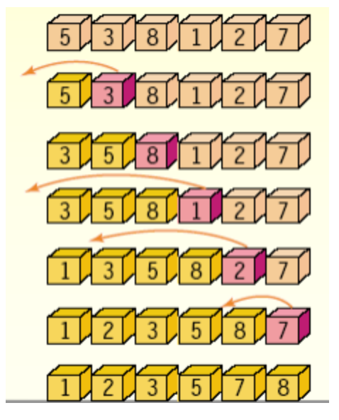

# 삽입정렬

**정렬이 되어있는 부분에 새로운 레코드를 적절한 위치에 삽입하는 정렬방식이다.**

시간복잡도 : O\(n^2\)   
현재의 위치에서, 그 이하 인덱스들의 값을 비교해보고 들어갈 위치를 찾는 것이다.



- **동작방식**

1. 정렬이 완료된 부분과 완료되지 않은 부분으로 나눈 후, 정렬 안된 데이터를 정렬 된 데이터의 특정 위치에 삽입한다.
2. 정렬이 완료된 영역 다음의 데이터가 정렬해야할 데이터이므로,
3. 만약 정렬해야할 데이터의 위치가 k 라면,  k-1 위치의 데이터와 비교하여 자신이 더 작으면 k-1의 데이터를 k 위치로 이동시킨다.
4. 다음 k-2의 데이터와 비교하고, 만약 k-2보다 자신이 크다면  k-1의 위치에 정착한다. \(= 데이터를 한 칸씩 뒤로 밀면서 내가 들어갈 자리를 찾는다.\)

```text
#Python
def insertion_sort(alist):
    for i in range(1, len(alist)) :
        CurrntElement = alist[i]
        j = i - 1
        
        while j > = 0 and alist[j] > CurrentElement :
         alist[j + 1] = alist[i]
         j = j - 1
         alist[j + 1] = CurrntElement
     return alist
```


