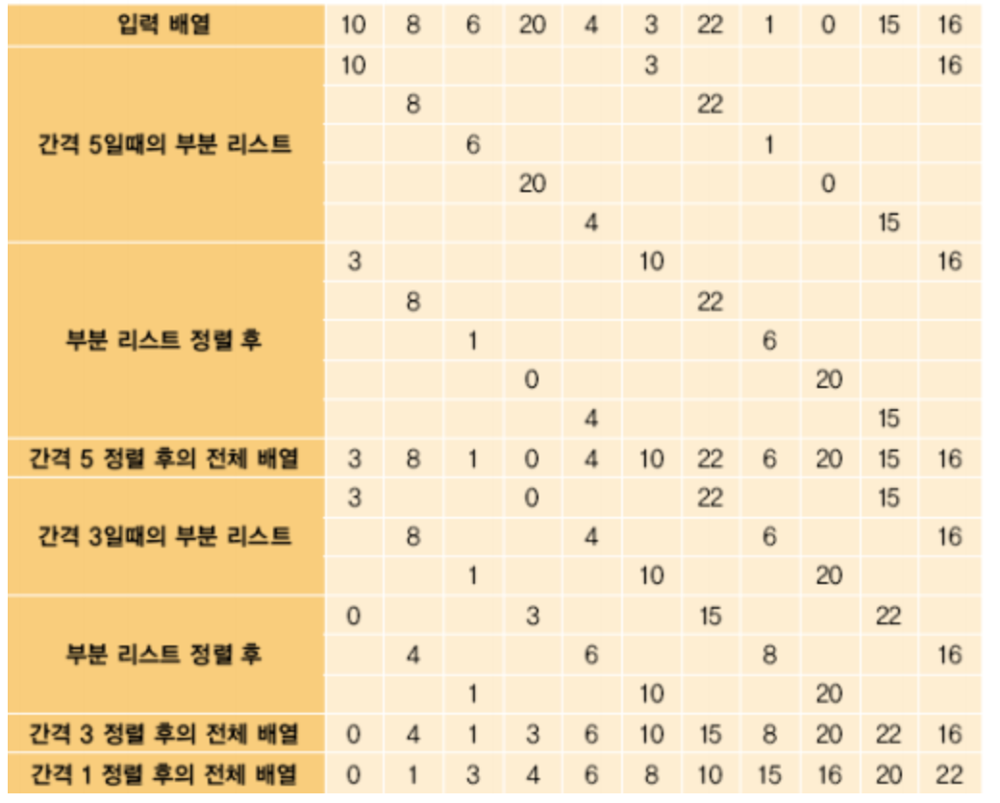

# 쉘 정렬

**삽입정렬의 단점을 보안하기 위해서 나온 방법이고 삽입정렬을 하기전 작은 부분으로 쪼개서 부분적으로 정렬한다.**

시간복잡도 : O\(n^2\) -  평균속도는 삽입보다 효율적이다.  
삽입 정렬이 이웃한 위치로만 이동했던 방면, 쉘 정렬은 멀리 떨어진 위치로도 이동한다.  
전체 리스트를 일정 간격의 부분리스트로 나누고 부분 리스트를 정렬한다.



**-동작방식**

**1. 전체 리스트를 일정 간격의 부분리스트로 나누고 부분 리스트를 정렬한다.  
2. 간격을 점점 줄여 다시 한다.  
3. 간격이 1이 될때까지 한다. \(1일 경우 사실상 삽입정렬과 마찬가지다.\)**


```text
# Python
def shell_sort(alist):
    sublistcount = len(alist)//2
    while sublistcount > 0:
        for start_position in range(sublistcount):
            gap_InsertionSort(alist, start_position, sublistcount)
        sublistcount = sublistcount//2
    return alist

def gap_InsertionSort(nlist,start,gap):
    for i in range(start+gap,len(nlist),gap):
        current_value = nlist[i]
        position = i
        while position>=gap and nlist[position-gap]>current_value:
            nlist[position]=nlist[position-gap]
            position = position-gap
        nlist[position]=current_value
```


