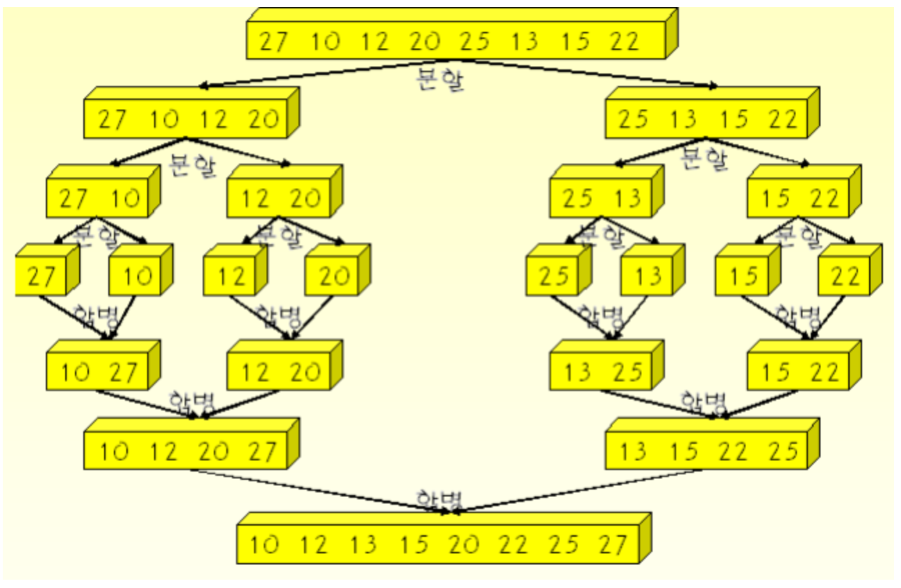

# 합병정렬

**리스트를 두개\(이상\)로 나누어 각각을 정렬한 다음, 다시 하나로 합치는 방법이다.**

시간복잡도 : O\(n logn\) - 쓸만하다. 평균, 최악, 최선 큰 차이가 없어 안정적이고 좋다.  
합병정렬은 분할정복 기법에 바탕이 있다.



  
**-동작방식-**

**1. 배열을 같은 크기의 2개의 부분 배열로 분할한다.  
2. 부분 배열의 크기가 충분히 작지 않으면 재귀호출을 이용하여 다시 분할정복기법을 적용한다. 그리고나서 부분배열을 정렬한다.   
3. 정렬된 부분배열을 하나의 배열에 통합한다.**

```text
# Python
def merge_sort(alist):
    if len(alist)>1:
        mid = len(alist)//2
        lefthalf = alist[:mid]
        righthalf = alist[mid:]
        p = len(lefthalf)
        q = len(righthalf)
        
        merge_sort(lefthalf)
        merge_sort(righthalf)
        
        i=0
        j=0
        k=0
        
        while i < p and j < q:
            if lefthalf[i] < righthalf[j]:
                alist[k] = lefthalf[i]
                i = i+1
            else:
                alist[k] = righthalf[j]
                j = j+1
            k = k+1

        while i < p:
            alist[k] = lefthalf[i]
            i = i+1
            k = k+1

        while j < q:
            alist[k] = righthalf[j]
            j = j+1
            k = k+1
```

