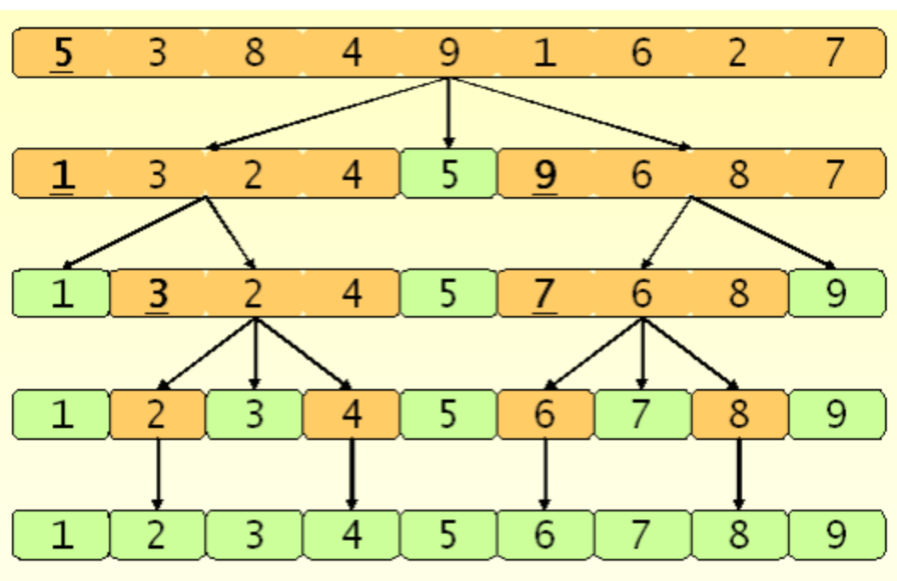

# 퀵 정렬

- 시간 복잡도 :  **O\(n log n\)**

\*\* 피벗이 중간 값일 때를 최선의 경우라 생각할 수 있지만, 퀵 정렬의 경우 예외적으로 중간에 가까운 피벗을 선택하는 방법을 적용하여 최선에 가까운 성능을 평균적으로 보인다고 한다. 

\*\* 병합 정렬과 시간 복잡도는 같지만, 별도의 메모리 공간을 필요로 하지 않으므로 실제로 가장 빠르다.



- 과정

가장 처음 값을 피벗으로 잡는다.

a : 왼쪽에서 오른쪽으로 피벗보다 큰 값을 만날때까지 이동하고,    
b: 오른쪽에서 왼쪽으로 피벗보다 작은값을 만날때까지 이동한다. 

그리고 그 값을 교환한다. 만약 a와 b가 교차하게 되면 \( a&gt;b\)가 되면 탐색을 멈추고, b와 피벗을 교환한다.  
-&gt; 이 과정을 통해  피벗의 왼쪽에는 피벗보다 작은 값들만, 오른쪽에는 피벗보다 큰 값들만 있게 된다.

그리고 피벗을 중심으로 왼쪽과 오른쪽을 나누어 재귀적으로 진행한다.  
사실 피벗이 가장 중간값이라면 제일좋은 성능을 보일 수 있다. 만약 이미 잘 정렬되있는 배열을 돌린다면, 1부터 n-1까지의 값들이 순서대로 피벗이 되어 정렬을 하게 된다.  
중간 값을 찾는 알고리즘이 있긴 하지만 오히려 그거 때문에 성능이 더 나빠져서 실제로는 안쓴다고 한다.  
그냥 세 개 데이터를 추출하여 그 중에 중간 값을 피벗으로 선택하는 것이 ....

```text
# Python
def quick_sort(alist):
    if len(alist) < 2:
        return alist
    else:
        pivot = alist[0]
        less = [i for i in alist[1:] if i <= pivot]
        greater = [i for i in alist[1:] if i > pivot]
        return quick_sort(less) + [pivot] + quick_sort(greater)
```

