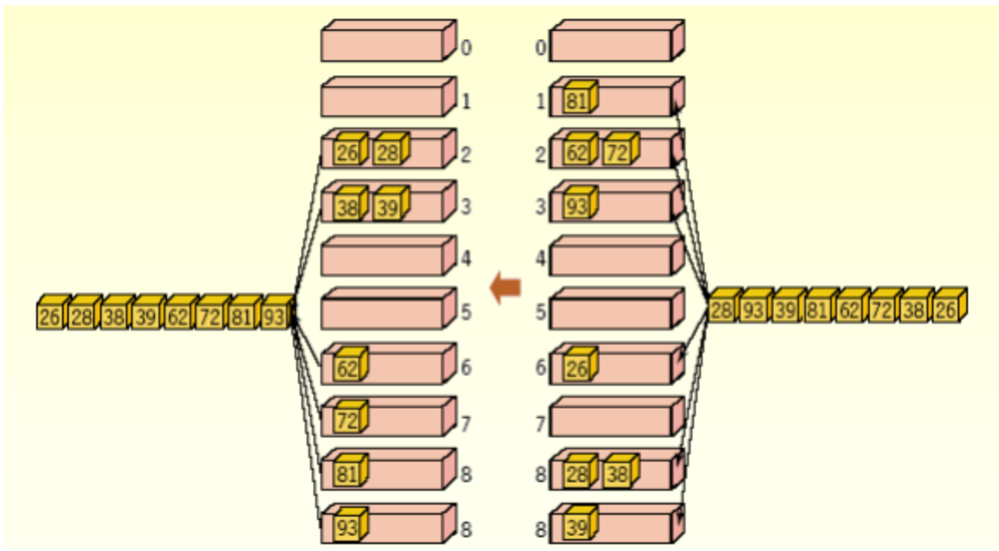

# 기수정렬

기수 정렬은 비교 연산을 하지 않고 데이터를 정렬할 수 있다. 그러나 데이터의 길이가 제한적일 수 있다.

간단하게 생각해보면, 0,8,3,5,4의 데이터를 비교한다면, 크기 10짜리의 배열의 인덱스의 그 값을 넣고 \( arr\[8\] = 8 이런식 \) 그냥 배열을 순차적으로 출력하면 되는 것...

하지만 이를 좀 바꾸어서, 3자리 수의 데이터 비교를 5개의 버킷\(공간\)을 가지고 정렬할 수 있다. 이를 LSD 기수 정렬\(Least Significant Digit\)라고 하며, 덜 중요한 자리 수인 일의자리수 부터 정렬을 진행해 나간다는 것이다.



- 과정

데이터: 134, 224, 232, 122

일의자리수 기준으로 하여 순서대로 버킷에 넣는다.

버킷 2: 122, 232 \( -&gt; 넣은 순서\)

버킷 5: 224, 134

현재 상태 : 232, 122, 134, 224 \( 꺼낼때는 먼저 넣은 것부터 \)

십의 자리수 기준으로 버킷에 넣는다.

버킷2: 224, 122

버킷3: 134, 232

현재 상태 : 122, 224, 232, 134

백의 자리수 기준으로 버킷에 넣는다.

버킷 1: 134, 122

버킷 2: 232, 224

현재 상태 : 122, 134, 224, 232

\*\* MSD 기수 정렬 \(Most Significat Digit\)은 가장 중요한 자리수, 큰 자리수부터 정렬을 진행한다. 이 정렬의 가장 큰 장점은 중간에 정렬이 완료될 수 있으므로 끝까지 가지 않아도 된다. 그러나  중간에 정렬이 완료되었는데도 불구하고 끝까지 정렬할 시 정렬이 제대로 되지 않는다. 따라서 중간에 데이터를 점검해야하는 상황이 발생한다. \( 모든 데이터에 일괄적 과정을 거칠 수 없다 \) 따라서 이를 해결할 알고리즘을 필요로 하는데 이게 더 시간이 오래 걸릴 수 있음...

- 시간 복잡도

비교연산이 아닌 데이터의 삽입과 추출이 핵심 연산이다.  
가장 긴 데이터의 길이만큼 반복하고, 정렬대상의 수 만큼 버킷에 데이터를 삽입하고 추출한다.

데이터의 길이\(l\) x 데이터의 수\(n\) = O\(ln\) = **O\(n\)**  


```text

```


