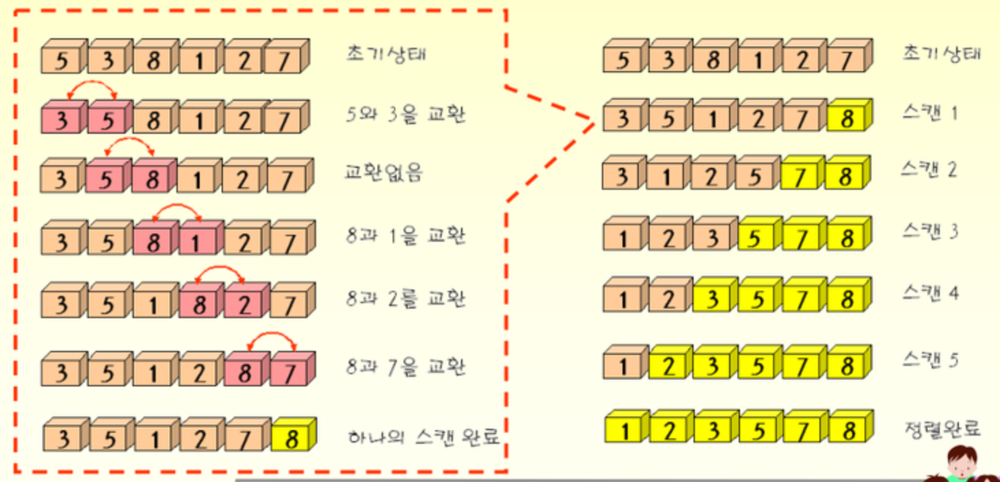

# 버블정렬

**원소의 이동이 거품이 수면에 올라오는 듯한 모습을 보이기 때문에 버블정렬이다.**

시간복잡도 : O\(n²\) - 너무 느린 정렬  
두 인접한 원소를 검사해서 정렬하는 방법이다.



#### - 동작방식

1. 배열의 첫요소와 두째요소의 대소관계를 비교한다.  
2. 대소관계에따라 위치를 바꾼다.  
3. 비교하는 배열의 첨자를 하나씩 증가해서 1~2단계를 반복한다.  
4. 끝 요소까지 비교했다면 비교했던 제일 마지막 첨자는 제외한다.

메모리를 적게 사용하고 구현하기 쉽다. 입력량이 적으면 효율적이다.  
하지만 입력량이 많아지면 비효율적이다. \(잘 사용 안함\)

```text
#Python

def bubble_sort(alist) :
    for passnum in range(1, len(alist)-1) :
        for i in range(1, len(alist)-passnum+1) :
            if alist[i - 1] > alist[i] :
                temp = alist[i - 1] 
                alist[i - 1] = alist[i]
                alist[i] = temp
    return alist
```

